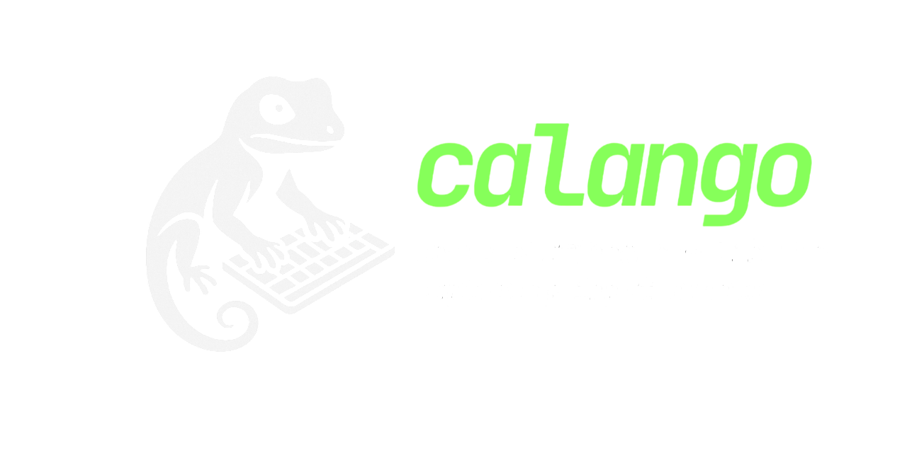

**Calango** is a cross-platform bloat-free library for capturing operating system inputs.

the central part which is the capture of inputs and is completely header only, because it only needs the calls from the respective operating system.

the exposed classes of cpp input-lib are virtual classes (starting with 'I') that inherit from another class that has common denominators.
an example with the IMouse and IKeyboard classes:

the library never exposes concrete classes, only interfaces (abstract classes) and you can use, 
through the backend of your system, the method `GetBackend(...);`
## Base::IButton

the `Base` namespace is responsible for exposing common denominators internally in the application.

the `IButton` interface exposes all the methods that any device containing a button should have. The signatures are as follows:

`virtual void Listen() = 0;`

responsible for polling the internal structures and descriptors of the device.

`virtual bool IsPressed() = 0;`

`virtual bool IsReleased() = 0;`

`virtual void IsPressed(std::function<void()>) = 0;`

`virtual void IsReleased(std::function<void()>) = 0;`

`virtual void Stop() = 0;`

The lib, in turn, can capture callbacks in addition to standard polling, with the Listen() and Stop() methods, which allow it to repeatedly listen to the system, and stop to stop listening.

To delete the pointer to the specific class, simply use the Button::Free(Base::IButton **) function.
